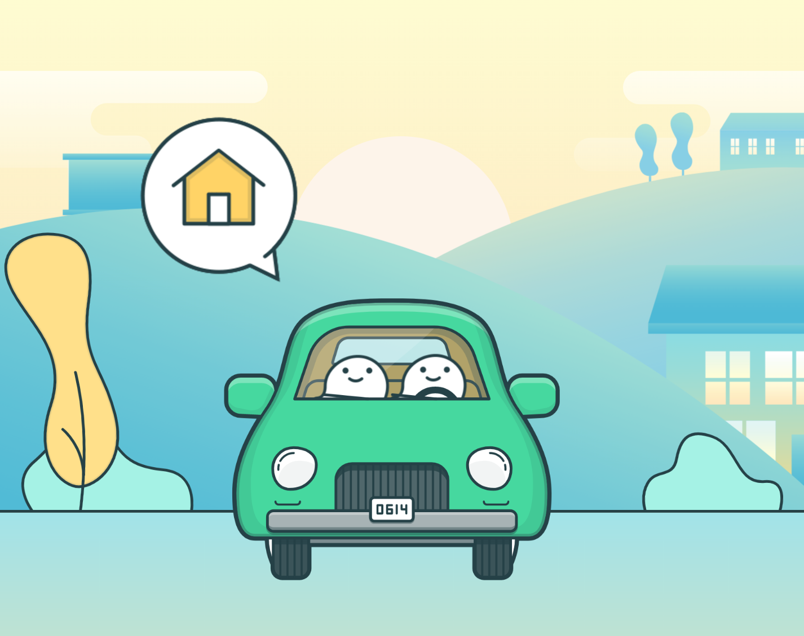

## Goal
The goal of the carpool feature is to help the people in the group sort their transportation requirements for the backpacking trip.

## Requirements

* Find out appropriate car requirements according to the road conditions.
* Suggest nearby parking spots based on the co-ordinates of the trailhead.
* Assign car owners and make sure that everyone in the group has a ride.
* Find out permit information (have permit information as a part of user profiles with validity).

## User scenarios

### Filling out a driving survey

* Everyone in the group will have the opportunity to fill up a survey around carpooling requirements - whether they are willing to drive and their car meets the suggested requirements for the trailhead.
* By default everyone will need a ride.
* For carpooling efforts, we can have a common meeting spot to avoid managing uber-ish challenges.

### Cost splitting (Optional)

* Post the trip, the car drivers can fill in who all carpooled with them.
* The web-app will then add transactions to the existing Splitwise group.

### Add permits

* Ideally, we'd like the backend to figure out the permit requirements since they are easy to scrape
* However, if we are not able to do so, we can have any of the users add this information for others to view
* Each user will have a flow to add the permit information to the trip. They can add multiple permits as well depending upon the overall trip requirements

### Rough Driving time estimates (Optional)

* Based on who all might be carpooling with the drivers, we can have the application calculate ETAs for each user to reach the trailhead.
* The ETAs will help in some form of notifications to the users or just additional information on when they should leave.
* It would be great to have their route charted out with Google/Apple Maps integrated with the various stops.

### Constraints

The biggest constraint is the absence of any public APIs for fetching the trail information, especially around driving and parking lots etc. 

### Assumptions

The biggest assumption here is that we already have the trip information available before the carpool section can get to work and that includes:

* The route which the group intends to take including all the milestones
* Number of people and possible their pick-up points (optional)
* How many days they intend to spend

## Daily Sync

Even though, this is supposed to be a fun event, we need to have a way to unblock people and answer any burning questions and most importantly, know what everybody in the group is working on! 

So...

We will be using the [Coordination Teams Channel](https://teams.microsoft.com/l/channel/19%3a0dd59de53ad341d59f4d9120e1273dc4%40thread.tacv2/Coordination?groupId=c1974162-33b6-4b3f-b0b4-b05e0fe61bde&tenantId=72f988bf-86f1-41af-91ab-2d7cd011db47) for discussions around this area.

Well, yes, it may be too early than your usual stand-up meetings but then, it's the Hackathon! Let's do something different. 

### Why join the Carpool feature?

We have a lot of unknowns in this area since all the information we need is not something that's readily available e.g. 

* parking lot information around the trailheads
* permit information required for the trip
* efficient carpooling so that drivers don't have to drive too much to pick people up
* and some other things...

In short, we have a lot of work to do and this is an important information to solve since we probably can't make it to the trailheads just walking!!

