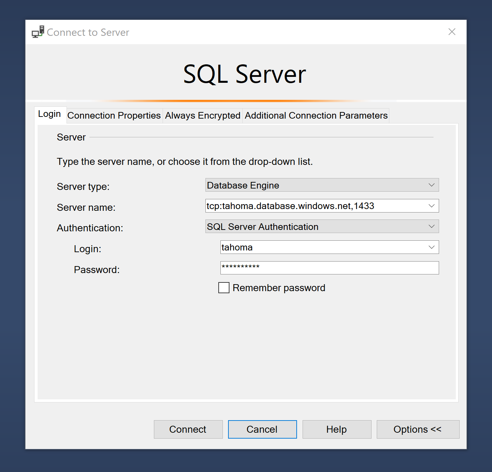

# Planner

## Database access

Azure subscription: \<to be shared separately\>
Resource group: Hackathon2021
SQL server name: `tahoma`
SQL database name: `tahoma`

To view and edit the database locally, you can use [SQL Management Studio](https://docs.microsoft.com/en-us/sql/ssms/download-sql-server-management-studio-ssms?view=sql-server-ver15) with the following configuration:

- Server type: Database Engine
- Server name: `tcp:tahoma.database.windows.net,1433`
- Authentication: SQL Server Authentication
- Login: `tahoma`
- Password: \<to be shared separately\>

When prompted, sign it to your Azure account.

If you get an error message saying your IP addressed is not allowed, go to the SQL Database in the Azure portal. On the overview page, click "Set server firewall", and add your IP there. Give it any rule name, and you can use your same IP for Start IP and End IP.



## Local development

Open appsettings.json file, and provide the value for `DB_CONNECTION_STRING` setting. You can find the connection string for the "Tahoma" SQL Database in the Azure portal, and replace the `{your_password}` placeholder with the password shared separately.

Make sure to undo the changes to this file before checking in code changes.

## Folder structure

Controllers folder defines the operations (e.g.: CRUD - Create, Read, Update, Delete) for the various entities (e.g.: hiker, trip).

Models folder has the data structure for the SQL database table (e.g.: `Hiker`), and their corresponding model for the view (e.g.: `HikerViewModel`).

Scripts folder has the SQL scripts for creating the database tables, and populating them with some sample values. They have been executed against the SQL database, and can be re-run manually to roll back to the initial state.

Views folder has the web pages. 

`PlannerDbContext` has the connection to the SQL database.

```
Planner/
├─ Controllers/
│  ├─ HikerController.cs
│  ├─ HomeController.cs
│  ├─ ResourcesController.cs
│  ├─ ...
├─ Models/
│  ├─ Hiker.cs
│  ├─ HikerViewModel.cs
│  ├─ ...
├─ Scripts/
│  ├─ create_tables.sql
│  ├─ insert_hiker.sql
│  ├─ ...
├─ Views/
│  ├─ Hiker/
│     ├─ Create.cshtml
│     ├─ Delete.cshtml
│     ├─ Details.cshtml
│     ├─ Edit.cshtml
│     ├─ Index.cshtml
│  ├─ Home/
│     ├─ ...
│  ├─ Resources/
│     ├─ ...
├─ PlannerDbContext
├─ README.md
├─ ...
```

## SQL queries

```
-- Add a new required column with default value
ALTER TABLE dbo.hiker
ADD user_name VARCHAR (50) NOT NULL DEFAULT '0';

-- Update specific column(s) of a row
UPDATE dbo.hiker
SET password = 'password', user_name= 'jimmy'
WHERE id = 2;
```